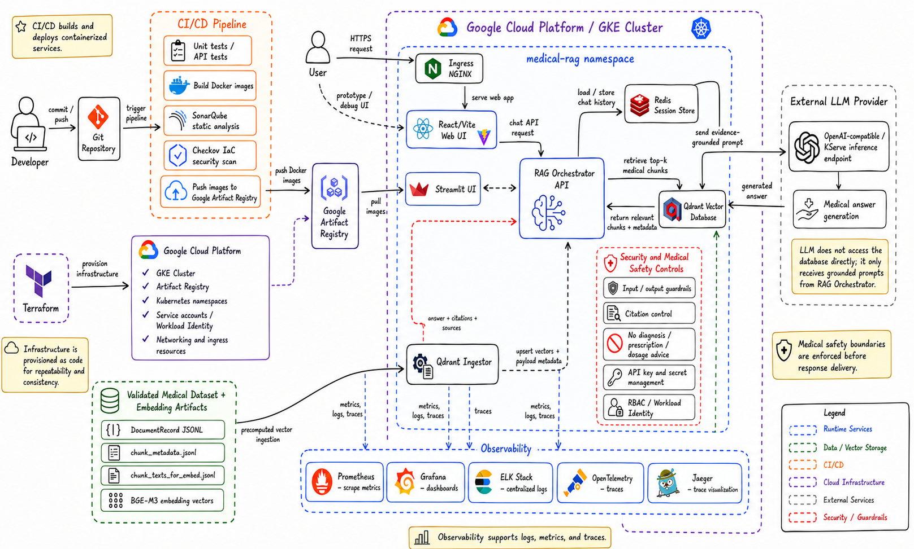

# 🩺 Cloud-Native Medical RAG Platform

<div align="center">

**Trợ lý hỏi đáp y khoa dựa trên RAG, tối ưu cho dữ liệu y khoa Việt Nam và triển khai cloud-native.**

[](https://www.python.org/)
[](https://fastapi.tiangolo.com/)
[](https://react.dev/)
[](https://www.docker.com/)
[](https://qdrant.tech/)
[](https://cloud.google.com/kubernetes-engine)

</div>

> [!IMPORTANT]
> Đây là hệ thống hỗ trợ tra cứu và tổng hợp thông tin y khoa, **không thay thế bác sĩ**, không dùng để tự chẩn đoán, kê đơn hoặc quyết định liều dùng. Mọi thông tin quan trọng cần được kiểm chứng bởi nhân viên y tế có chuyên môn.



## Mục lục

- [Giới thiệu](#giới-thiệu)
- [Tính năng chính](#tính-năng-chính)
- [Kiến trúc và luồng xử lý](#kiến-trúc-và-luồng-xử-lý)
- [Công nghệ sử dụng](#công-nghệ-sử-dụng)
- [Khởi chạy nhanh bằng Docker](#khởi-chạy-nhanh-bằng-docker)
- [Cài đặt môi trường phát triển](#cài-đặt-môi-trường-phát-triển)
- [Chuẩn bị và quản lý dữ liệu](#chuẩn-bị-và-quản-lý-dữ-liệu)
- [Sử dụng API](#sử-dụng-api)
- [Cấu hình quan trọng](#cấu-hình-quan-trọng)
- [Kiểm thử và đánh giá](#kiểm-thử-và-đánh-giá)
- [Triển khai GKE](#triển-khai-gke)
- [Cấu trúc thư mục](#cấu-trúc-thư-mục)
- [Xử lý lỗi thường gặp](#xử-lý-lỗi-thường-gặp)

## Giới thiệu

Cloud-Native Medical RAG Platform là nền tảng hỏi đáp y khoa sử dụng **Retrieval-Augmented Generation (RAG)**. Hệ thống truy hồi các đoạn tài liệu liên quan từ Qdrant, xây dựng prompt có căn cứ, gọi một endpoint LLM tương thích OpenAI và trả về câu trả lời kèm citation/evidence.

Dự án hướng đến ba mục tiêu:

1. Chuẩn hóa tài liệu y khoa Việt Nam thành bộ dữ liệu có lineage và QA rõ ràng.
2. Giảm hallucination bằng cách buộc câu trả lời bám theo evidence đã truy hồi.
3. Hỗ trợ cả phát triển local bằng Docker Compose và triển khai cloud-native trên GKE bằng Terraform, Helm và Jenkins.

## Tính năng chính

- RAG API xây dựng bằng FastAPI, hỗ trợ trả lời thường và SSE streaming.
- Semantic retrieval với embedding `BAAI/bge-m3` và Qdrant.
- Hybrid retrieval kết hợp vector search với article-level lexical index.
- Redis lưu lịch sử hội thoại và thông tin session.
- React/Vite UI có quản lý cuộc hội thoại, nguồn tham khảo và evidence panel.
- Streamlit UI dành cho triển khai Kubernetes hiện có trong `services/streamlit-ui`.
- Citation control, evidence normalization, conflict detection và answer verification.
- NeMo Guardrails cùng các ràng buộc an toàn y khoa.
- Pipeline crawl → extract → ETL → QA → release → embedding → ingest.
- Observability qua Prometheus, Grafana, ELK, OpenTelemetry và Jaeger.
- CI/CD với Jenkins, SonarQube, Checkov, Google Artifact Registry và Helm.

## Kiến trúc và luồng xử lý

### Luồng phục vụ câu hỏi

1. Người dùng gửi câu hỏi từ React/Vite UI hoặc Streamlit UI.
2. RAG Orchestrator phân loại và có thể viết lại câu hỏi.
3. Retriever tạo embedding cho câu hỏi và lấy top-k chunks từ Qdrant.
4. Các bước quality filter, aggregation, coverage và conflict detection xử lý evidence.
5. Orchestrator gửi prompt đã được grounding đến LLM provider; LLM không truy cập trực tiếp Qdrant.
6. Answer verifier và guardrails kiểm tra câu trả lời trước khi trả về UI.
7. Redis lưu session; metrics, logs và traces được đẩy tới hệ thống observability.

### Các dịch vụ runtime

| Thành phần | Vai trò | Cổng local |
|---|---|---:|
| `web-ui` | React/Vite chat UI | `5173` |
| `rag-orchestrator` | FastAPI RAG API | `8000` |
| `qdrant` | Vector database | `6333` |
| `redis` | Session store/cache | `6379` |
| `qdrant-ingestor` | Chunk, embedding và ingest online | Chạy theo job |
| `qdrant-precomputed-ingestor` | Nạp vector đã tính sẵn | Chạy theo job |

## Công nghệ sử dụng

| Lớp | Công nghệ |
|---|---|
| Backend | Python 3.11, FastAPI, Pydantic, Uvicorn |
| Retrieval | Qdrant, BGE-M3, FastEmbed, Sentence Transformers |
| LLM | Endpoint tương thích OpenAI; cấu hình mặc định local dùng DeepSeek API |
| Session/cache | Redis 7.2 |
| Frontend | React 19, TypeScript, Vite 7 |
| Data | JSONL, NumPy embeddings, pipeline ETL Python |
| Safety | NeMo Guardrails, citation control, answer verifier |
| Container | Docker, Docker Compose |
| Cloud | Google Cloud, GKE, Artifact Registry |
| Infrastructure | Terraform, Kubernetes, Helm |
| CI/CD | Jenkins, SonarQube, Checkov |
| Observability | Prometheus, Grafana, ELK, OpenTelemetry, Jaeger |

## Khởi chạy nhanh bằng Docker

### 1. Yêu cầu

- Git
- Docker Desktop hoặc Docker Engine + Compose v2
- Tối thiểu khoảng 8 GB RAM trống; lần build đầu cần tải model embedding và có thể mất vài phút
- API key của LLM provider tương thích OpenAI
- Bộ dữ liệu/vector theo phần [Chuẩn bị và quản lý dữ liệu](#chuẩn-bị-và-quản-lý-dữ-liệu)

### 2. Clone repository

```bash
git clone https://github.com/jprosun/Cloud-Native-Medical-RAG-Platform.git
cd Cloud-Native-Medical-RAG-Platform
```

### 3. Tạo file bí mật local

Tạo `.env` ở thư mục gốc:

```dotenv
DEEPSEEK_API_KEY=your_deepseek_api_key

# Chỉ cần khi bật external search
TAVILY_API_KEY=
```

Không commit `.env` hoặc API key lên Git. File này đã được loại trừ bởi `.gitignore`.

### 4. Khởi động Qdrant và Redis

```bash
docker compose -f docker-compose.local.yml up -d qdrant redis
```

Kiểm tra Qdrant:

```bash
curl http://localhost:6333/healthz
```

### 5. Audit và ingest vector có sẵn

Compose hiện dùng:

- Dataset: `medqa_release_v4_all_bge_m3`
- Profile: `multilingual`
- Collection: `medqa_release_v4_all_bge_m3`
- Vector dimension của BGE-M3: `1024`

Sau khi đặt artifacts đúng cấu trúc, chạy:

```bash
python tools/audit_embedding_artifacts.py \
  --dataset-id medqa_release_v4_all_bge_m3 \
  --profile multilingual
```

PowerShell:

```powershell
python tools\audit_embedding_artifacts.py `
  --dataset-id medqa_release_v4_all_bge_m3 `
  --profile multilingual
```

Chỉ ingest khi audit trả về trạng thái `pass`:

```bash
docker compose -f docker-compose.local.yml \
  --profile precomputed-ingest run --rm --build qdrant-precomputed-ingestor
```

Muốn xóa và dựng lại collection một cách có chủ đích:

```bash
docker compose -f docker-compose.local.yml \
  --profile precomputed-ingest run --rm --build \
  -e QDRANT_RECREATE_COLLECTION=true qdrant-precomputed-ingestor
```

> [!CAUTION]
> `QDRANT_RECREATE_COLLECTION=true` sẽ xóa collection trùng tên trước khi ingest lại.

### 6. Khởi động API và React UI

```bash
docker compose -f docker-compose.local.yml --profile docker-ui up -d --build
```

Truy cập:

- React UI: <http://localhost:5173>
- FastAPI Swagger: <http://localhost:8000/docs>
- API readiness: <http://localhost:8000/ready>
- Prometheus metrics: <http://localhost:8000/metrics>
- Qdrant dashboard: <http://localhost:6333/dashboard>

Theo dõi log:

```bash
docker compose -f docker-compose.local.yml logs -f rag-orchestrator web-ui
```

Dừng hệ thống nhưng giữ volume Qdrant:

```bash
docker compose -f docker-compose.local.yml down
```

Muốn xóa cả volumes local, dùng `down -v` và kiểm tra dữ liệu cần giữ trước khi chạy.

### Cấu hình ưu tiên độ trễ

Profile sau bật cache và HTTP keep-alive nhưng giữ nguyên pipeline chất lượng chính:

```bash
docker compose \
  -f docker-compose.local.yml \
  -f docker-compose.fast.yml \
  --profile docker-ui up -d --build
```

## Cài đặt môi trường phát triển

Docker là cách chạy được khuyến nghị. Nếu cần debug từng dịch vụ, có thể chạy native như sau.

### Backend FastAPI

PowerShell:

```powershell
py -3.11 -m venv .venv
.\.venv\Scripts\Activate.ps1
python -m pip install --upgrade pip
pip install -r services\rag-orchestrator\requirements.txt

$env:PYTHONPATH = "$PWD\services"
$env:QDRANT_URL = "http://localhost:6333"
$env:QDRANT_COLLECTION = "medqa_release_v4_all_bge_m3"
$env:REDIS_URL = "redis://localhost:6379/0"
$env:KSERVE_ENABLED = "true"
$env:KSERVE_BASE_URL = "https://api.deepseek.com"
$env:KSERVE_COMPLETIONS_PATH = "/chat/completions"
$env:LLM_MODEL_ID = "deepseek-v4-flash"
$env:LLM_API_KEY = $env:DEEPSEEK_API_KEY

python -m uvicorn --app-dir services\rag-orchestrator app.main:app `
  --host 0.0.0.0 --port 8000 --reload
```

Qdrant và Redis vẫn có thể chạy bằng Docker:

```bash
docker compose -f docker-compose.local.yml up -d qdrant redis
```

### React/Vite UI

Yêu cầu Node.js 24 tương ứng với image trong `services/web-ui/Dockerfile`.

```bash
cd services/web-ui
npm ci
npm run dev
```

Vite tự proxy `/api`, `/ready`, `/health` và `/metrics` tới `http://localhost:8000`. Có thể đổi backend bằng biến `VITE_RAG_API_PROXY_TARGET`.

## Chuẩn bị và quản lý dữ liệu

### Nguyên tắc

- `rag-data/` là nơi duy nhất chứa raw data, ETL artifacts, dataset releases và embedding artifacts.
- `rag-data/` bị Git ignore vì dữ liệu thường lớn hoặc có điều khoản phân phối riêng.
- Qdrant là retrieval index đang chạy; `rag-data/` không thay thế Qdrant.
- Không ingest nếu schema QA hoặc embedding alignment audit chưa đạt.

### Cấu trúc canonical

```text
rag-data/
├── qa/
├── sources/
│   └── <source_id>/
│       ├── raw/
│       ├── intermediate/
│       ├── processed/
│       ├── records/
│       │   └── document_records.jsonl
│       └── qa/
├── datasets/
│   └── <dataset_id>/
│       ├── records/
│       │   └── document_records.jsonl
│       ├── qa/
│       └── manifest.json
└── embeddings/
    ├── exports/
    │   └── <dataset_id>/<profile>/
    ├── staging/
    │   └── <dataset_id>/<profile>/
    └── runs/
```

Tạo toàn bộ khung thư mục:

```bash
python tools/scaffold_rag_data_layout.py
```

### Artifacts tối thiểu để chạy bộ vector precomputed

```text
rag-data/embeddings/
├── exports/medqa_release_v4_all_bge_m3/multilingual/
│   ├── chunk_metadata.jsonl
│   ├── chunk_texts_for_embed.jsonl
│   ├── kaggle_embedding_input.jsonl
│   └── embedding_manifest.json
└── staging/medqa_release_v4_all_bge_m3/multilingual/
    ├── embeddings.npy
    └── chunk_ids.json
```

Các file `chunk_metadata.jsonl`, `chunk_texts_for_embed.jsonl`, `chunk_ids.json` và các hàng trong `embeddings.npy` phải cùng thứ tự, cùng số lượng và cùng ID. Script audit kiểm tra alignment trước khi import.

### Pipeline dữ liệu đầy đủ

#### 1. Crawl/download nguồn

Ví dụ các nguồn tiếng Anh:

```bash
python -m pipelines.etl.medlineplus_scraper
python -m pipelines.etl.who_scraper
python -m pipelines.etl.ncbi_bookshelf_scraper
```

Dữ liệu raw được ghi vào `rag-data/sources/<source_id>/raw/`.

#### 2. Extract và chuẩn hóa tài liệu Việt Nam

```bash
python tools/extract_digital_pdf.py
python -m pipelines.etl.vn.vmj_issue_splitter
python -m pipelines.etl.vn.vn_txt_to_jsonl --source-id vmj_ojs
```

Đầu ra chuẩn của mỗi nguồn là:

```text
rag-data/sources/<source_id>/records/document_records.jsonl
```

#### 3. Build dataset release

```bash
python tools/build_dataset_release.py --dataset-id vi_core_v1 --source-group vi
python tools/build_dataset_release.py --dataset-id all_corpus_v1 --source-group all
```

Mỗi release có records, manifest và kết quả QA riêng, giúp tái lập chính xác dữ liệu đã ingest.

#### 4. QA trước ingest

```bash
cd services/qdrant-ingestor
python -m qa_pre_ingest.run_all_checks \
  ../../rag-data/datasets/all_corpus_v1/records/document_records.jsonl
```

#### 5. Export chunks để embedding offline

```bash
python tools/kaggle/export_chunks_for_kaggleV2.py \
  --dataset-id all_corpus_v1 \
  --profile multilingual
```

Script tạo text, metadata, Kaggle input và manifest dưới `rag-data/embeddings/exports/`. Mặc định script từ chối ghi đè; chỉ dùng `--overwrite` khi thực sự muốn tạo lại release.

#### 6. Tính embedding

Upload `kaggle_embedding_input.jsonl` vào notebook/script GPU trong `tools/kaggle/`. Với BGE-M3, vector phải có dimension `1024`.

Kết quả cần gồm:

- `embeddings.npy`
- `chunk_ids.json`
- `embedding_manifest.json`

#### 7. Audit và ingest

```bash
python tools/audit_embedding_artifacts.py \
  --dataset-id all_corpus_v1 \
  --profile multilingual
```

Đặt `EMBED_DATASET_ID`, `KAGGLE_PROFILE` và `QDRANT_COLLECTION` cùng một release trước khi chạy `services/qdrant-ingestor/ingest_kaggle_precomputed.py`.

### Trường dữ liệu và lineage

Một `DocumentRecord` điển hình gồm nội dung, định danh và metadata như `doc_id`, `title`, `body`, `source_id`, `source_name`, `source_url`, `doc_type`, `specialty` và `quality_flags`.

Pipeline còn hỗ trợ các trường lineage:

- `source_file`, `raw_path`, `processed_path`, `intermediate_path`
- `parent_file`, `source_sha256`
- `crawl_run_id`, `etl_run_id`

Các trường này được chuyển tiếp vào Qdrant payload để truy vết chunk về tài liệu nguồn.

## Sử dụng API

### Endpoint chính

| Method | Endpoint | Mô tả |
|---|---|---|
| `GET` | `/health` | Health tổng quát |
| `GET` | `/ready` | Readiness probe |
| `GET` | `/live` | Liveness probe |
| `GET` | `/metrics` | Prometheus metrics |
| `POST` | `/api/chat` | Chat dạng JSON thông thường |
| `POST` | `/api/chat/stream` | Chat streaming qua SSE |
| `GET` | `/api/sessions` | Danh sách session |
| `GET` | `/api/session/{id}` | Lịch sử một session |
| `PUT` | `/api/session/{id}/title` | Đổi tên session |
| `DELETE` | `/api/session/{id}` | Xóa session |

### Gửi câu hỏi

```bash
curl -X POST http://localhost:8000/api/chat \
  -H "Content-Type: application/json" \
  -d '{
    "session_id": "demo-001",
    "message": "Triệu chứng thường gặp của tăng huyết áp là gì?",
    "answer_mode": "standard"
  }'
```

PowerShell:

```powershell
$body = @{
  session_id = "demo-001"
  message = "Triệu chứng thường gặp của tăng huyết áp là gì?"
  answer_mode = "standard"
} | ConvertTo-Json

Invoke-RestMethod -Method Post `
  -Uri "http://localhost:8000/api/chat" `
  -ContentType "application/json" `
  -Body $body
```

`answer_mode` nhận `standard` hoặc `thinking`. Response bao gồm `answer`, `retrieved_chunks`, `metadata`, `context_used`, trạng thái degraded và lịch sử session.

## Cấu hình quan trọng

Các giá trị local mặc định nằm trong `docker-compose.local.yml`.

| Biến | Mặc định local | Ý nghĩa |
|---|---|---|
| `QDRANT_URL` | `http://qdrant:6333` | Địa chỉ Qdrant |
| `QDRANT_COLLECTION` | `medqa_release_v4_all_bge_m3` | Collection truy hồi |
| `EMBEDDING_MODEL` | `BAAI/bge-m3` | Model embedding truy vấn |
| `RAG_TOP_K` | `14` | Số candidate chunks |
| `RAG_MIN_SCORE` | `0.45` | Ngưỡng similarity |
| `RAG_MAX_CONTEXT_TOKENS` | `6000` | Giới hạn context đưa vào LLM |
| `RAG_ENABLE_HYBRID` | `true` | Bật hybrid retrieval |
| `REDIS_URL` | `redis://redis:6379/0` | Session/cache store |
| `KSERVE_BASE_URL` | `https://api.deepseek.com` | Base URL của LLM provider |
| `LLM_MODEL_ID` | `deepseek-v4-flash` | Model generation |
| `LLM_API_KEY` | lấy từ `DEEPSEEK_API_KEY` | API key của provider |
| `LLM_TIMEOUT_S` | `60` | Timeout mỗi LLM request |
| `LLM_VERIFIER_ENABLED` | `true` | Bật answer verifier |
| `EXTERNAL_SEARCH_ENABLED` | `false` | Bật/tắt external web search |

Nếu đổi embedding model, phải đồng bộ model truy vấn, vector dimension, artifacts và Qdrant collection. Không dùng lẫn collection 384 chiều của cấu hình Helm cũ với BGE-M3 1024 chiều.

## Kiểm thử và đánh giá

### Backend unit tests

```bash
cd services/rag-orchestrator
python -m pytest --cov=app --cov-report=term --cov-fail-under=80
```

### Data/ingestor tests

Từ thư mục gốc:

```bash
python -m pytest services/qdrant-ingestor/tests
```

### Frontend build check

```bash
cd services/web-ui
npm ci
npm run build
```

### Benchmark

Các bộ gold và báo cáo nằm trong `benchmark/datasets/`. Runner chính:

```bash
python benchmark/runners/run_topic_gold_eval.py --help
python benchmark/runners/score_topic_gold.py --help
```

Không ghi đè kết quả benchmark lịch sử; tạo output mới có tên release/ngày chạy rõ ràng.

## Triển khai GKE

### 1. Provision hạ tầng

Yêu cầu Terraform `>= 1.5`, Google Cloud CLI và một VPC/subnet đã tồn tại đúng với các biến cấu hình.

```bash
cd terraform
terraform init
terraform plan -var="project_id=YOUR_PROJECT_ID"
terraform apply -var="project_id=YOUR_PROJECT_ID"
```

Lấy credentials sau khi tạo cluster:

```bash
gcloud container clusters get-credentials gke-medqa \
  --region us-central1 \
  --project YOUR_PROJECT_ID
```

### 2. Build và push images

Build ba image ứng dụng từ repository root:

```bash
docker build -f services/rag-orchestrator/Dockerfile -t REGISTRY/rag-orchestrator:TAG .
docker build -f services/streamlit-ui/Dockerfile -t REGISTRY/streamlit-ui:TAG .
docker build -f services/qdrant-ingestor/Dockerfile -t REGISTRY/qdrant-ingestor:TAG .
```

### 3. Deploy Helm

```bash
helm dependency build charts/model-serving
helm upgrade --install model-serving charts/model-serving \
  --namespace model-serving \
  --create-namespace \
  -f charts/model-serving/values-dev.yaml
```

> [!NOTE]
> Kiểm tra và đồng bộ `embeddingModel`, `vectorSize`, collection, image registry và secret LLM trước khi deploy. `values-dev.yaml` có thể dùng cấu hình embedding khác local Compose.

Jenkins pipeline tại `Jenkinsfile` thực hiện unit test, SonarQube, Checkov, build/push image và Helm deployment. Hướng dẫn thiết lập chi tiết nằm trong `ci/README.md`.

## Cấu trúc thư mục

```text
.
├── services/
│   ├── rag-orchestrator/    # FastAPI, retrieval, prompt, verifier, guardrails
│   ├── qdrant-ingestor/     # Chunking, QA và ingest Qdrant
│   ├── web-ui/              # React/Vite frontend
│   ├── streamlit-ui/        # Streamlit frontend cho Kubernetes
│   └── utils/               # Data paths, lineage, logging, tracing
├── pipelines/
│   ├── crawl/               # Crawlers và source registry
│   └── etl/                 # Extract, normalize, Vietnamese ETL
├── tools/                   # Audit, migration, release, embedding utilities
├── benchmark/               # Gold datasets, runners và báo cáo
├── charts/                  # Helm charts cho app và observability
├── terraform/               # GKE infrastructure as code
├── ci/                      # Jenkins image và tài liệu CI/CD
├── docs/assets/             # Hình ảnh tài liệu
├── docker-compose.local.yml # Local stack
├── docker-compose.fast.yml  # Latency/cache overrides
└── Jenkinsfile              # CI/CD pipeline
```

## Xử lý lỗi thường gặp

### UI mở được nhưng không gửi được câu hỏi

- Kiểm tra `http://localhost:8000/ready`.
- Xem log: `docker compose -f docker-compose.local.yml logs rag-orchestrator`.
- Đảm bảo đã dùng profile `docker-ui`, không chỉ chạy Compose mặc định.

### `Collection ... doesn't exist`

- Qdrant đã chạy nhưng vector chưa được ingest.
- Kiểm tra `QDRANT_COLLECTION` có trùng collection đã import không.
- Audit artifacts, sau đó chạy profile `precomputed-ingest`.

### `Mismatch IDs vs embeddings` hoặc `Alignment mismatch`

- `embeddings.npy`, `chunk_ids.json`, text và metadata không thuộc cùng một lần export.
- Không sửa hoặc sắp xếp độc lập từng file.
- Export/tính embedding lại và chạy audit trước khi ingest.

### Lỗi vector dimension

- BGE-M3 dùng vector 1024 chiều trong local flow này.
- Không ingest vector 384 chiều vào collection 1024 chiều hoặc ngược lại.

### Backend khởi động lâu

- Lần đầu Sentence Transformers tải model embedding vào volume `hf_model_cache`.
- Theo dõi healthcheck/log và chờ model load hoàn tất.

### LLM trả về 401/403

- Kiểm tra `DEEPSEEK_API_KEY` trong `.env`.
- Đảm bảo `KSERVE_BASE_URL`, completions path và model ID phù hợp provider đang dùng.
- Không in API key ra log hoặc commit vào repository.

## Tài liệu liên quan

- Data workflow: [`WORKFLOW.md`](WORKFLOW.md)
- Kiến trúc Kubernetes/Helm: [`charts/README.md`](charts/README.md)
- CI/CD Jenkins: [`ci/README.md`](ci/README.md)
- QA gate: [`Step6_QA Gate.md`](Step6_QA%20Gate.md)
- Kế hoạch ingest dữ liệu: [`planMD/hf_rag_dataset_ingest_plan.md`](planMD/hf_rag_dataset_ingest_plan.md)

---

<div align="center">

**Build grounded medical AI: traceable data, verifiable evidence, safer answers.**

</div>
